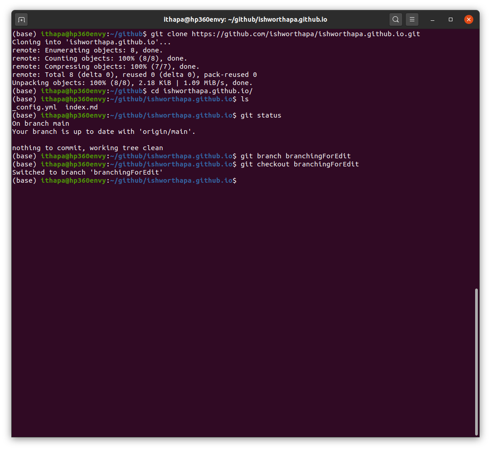
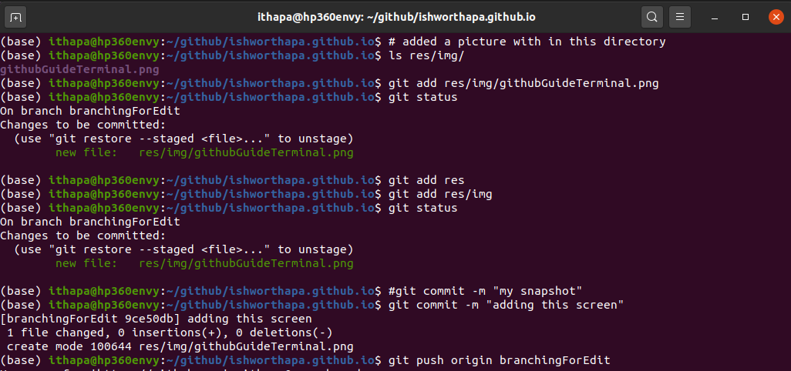
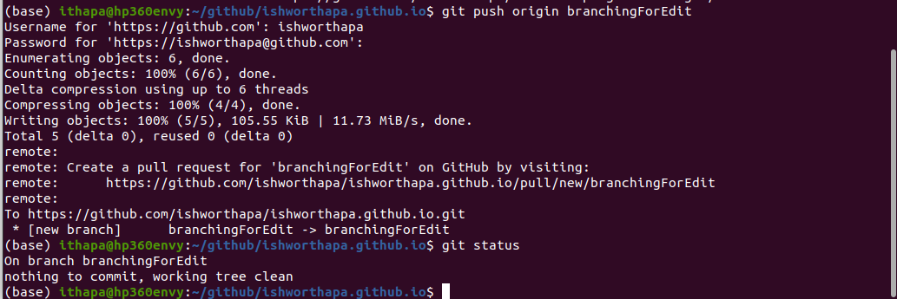

This web content shows my command history for branching and committing new files to the repository. If you look the code for index.md file, you will see examples of various Markdown features including:
1. Headers
2. Images
3. Ordered list
4. Links
5. Blockquotes 

# Creating a new branch in terminal


# Adding/Staging and committing a new file 


# Pushing a commit to a branch


# my shortlist of git commands
```
git clone <url_to_git>

git status

git add <file or folder>

git commit -m 'message'

git push origin master


git checkout <branch_name>

git push origin <branch_name>

git pull origin <branch_name>


```
